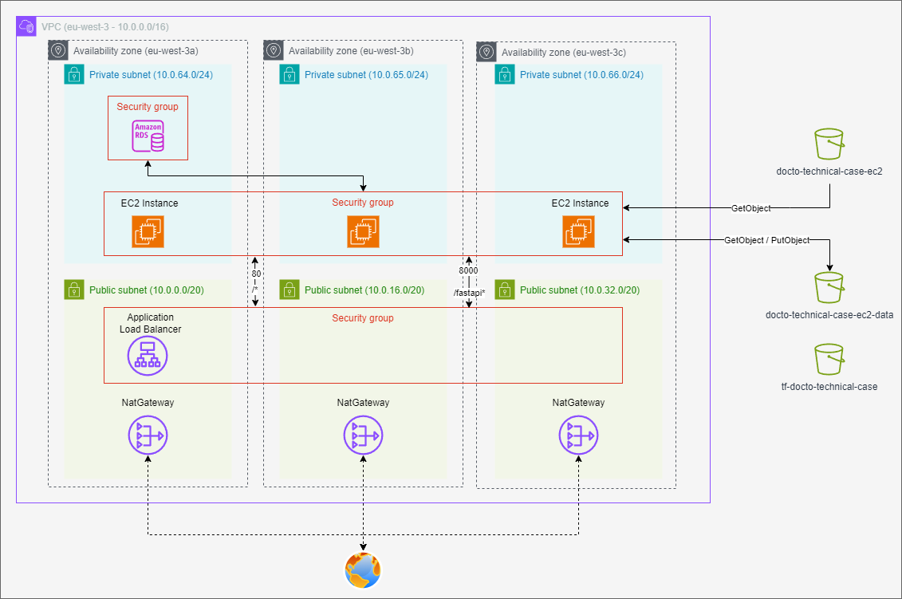

# Docto Technical Case

## AWS

You find here a basic documentation on the Terraform. If you want a more detailed documentation/explanation of the requirements and choices go [here](aws/README.md).

### Scenario

Your company is migrating its on-premises data infrastructure to AWS. As a DataOps Engineer Level 1, you have been tasked with automating the provisioning and management of AWS resources using Terraform.

### Architecture



### How to run - Terraform

```sh
./terraform.sh \
  --platform aws\
  --env <env> \
  --cmd <command>
```

Basic commands:
```sh
# Validate Terraform code
./terraform.sh \
  --platform aws\
  --env dev \
  --cmd validate

# Plan Terraform code
./terraform.sh \
  --platform aws\
  --env dev \
  --cmd plan

# Apply Terraform code
./terraform.sh \
  --platform aws\
  --env dev \
  --cmd apply

# Destroy Terraform code
./terraform.sh \
  --platform aws\
  --env dev \
  --cmd destroy
```

#### Addons

To validate all the good practices for Terraform are applied, use `[TFSec](https://github.com/aquasecurity/tfsec)`:

```sh
tfsec .
```

And to generate the `TFDoc`, use `[terraform-docs](https://github.com/terraform-docs/terraform-docs)`:

```sh
terraform-docs markdown --recursive --output-file TF_DOC.md ./
```

- Complete Documentation:
  - EC2 setup